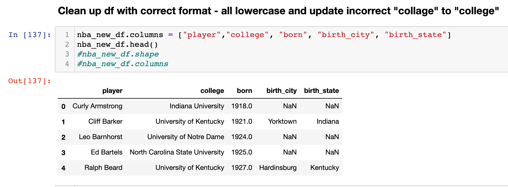
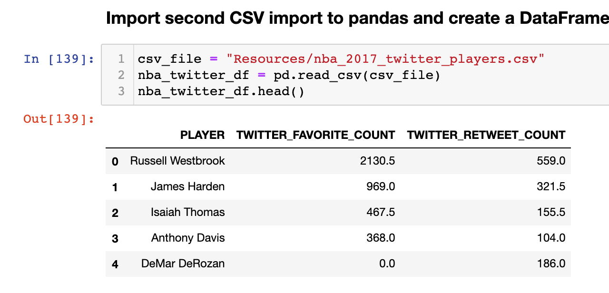
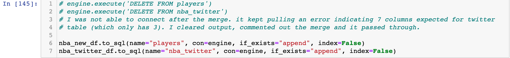
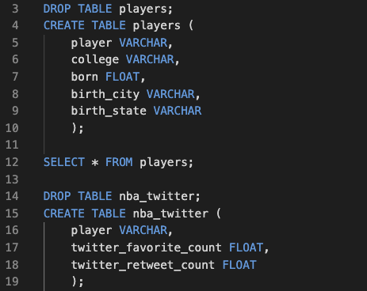
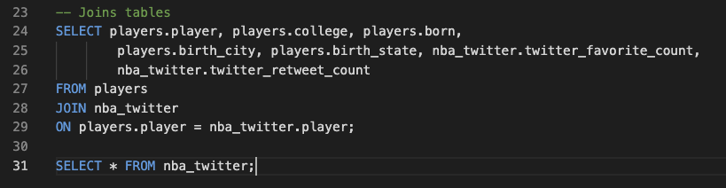
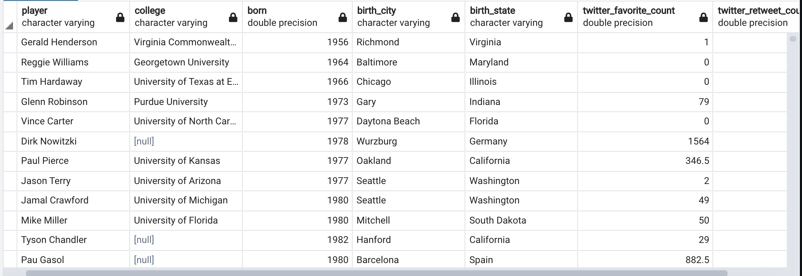

# ETL_Project 
### JB Kinlacheeny, Alvin McCray

## Datasets used: 

1.	NBA Players stats since 1950. https://www.kaggle.com/drgilermo/nba-players-stats?select=Players.csv 

2.	Social Power NBA. https://www.kaggle.com/noahgift/social-power-nba?select=nba_2017_twitter_players.csv

# EXTRACT:

# TRANSFORM:

# LOAD:

# CONCLUSION:

The ETL Project was a new assignment that both group members have never undertook. Finding data was not as problematic as the first group project. We were able to find data on Kaggle.com and chose to use NBA and NFL player data. Our initial intent was to generate these datasets into one dataset to identify where professional players come from (hometown city and state). After importing the datasets into pandas, we encountered issues with the data (i.e., no common values between the two). The final data used is two datasets described above. 

For the transformation portion, we imported the datasets into pandas and removed columns not necessary for the final two tables. We also renamed a few column names and transformed it to 2nd normal form. After cleaning the tables, we connected the engine to the postgres database server using python. Before loading the data, we generated the SQL code and created two tables (players & nba_twitter) in pgAdmin. After the tables were created in pgAdmin, we connected the engine and loaded the pandas dataframe into pgAdmin using the to.sql function. 

Once loaded, we were able to join the tables in SQL. 

Finally, once we understood the ETL process in more depth and taking into consideration key elements such as project management, deadlines, and available resources, we were able to complete the ETL in a timely manner. From the initial proposal to the final output, there were major alterations with the main being our datasets. A common source or key variable needs to be represented in both data sets. For our project, it was “players.” 
